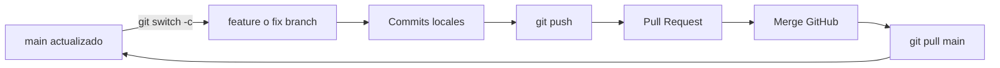
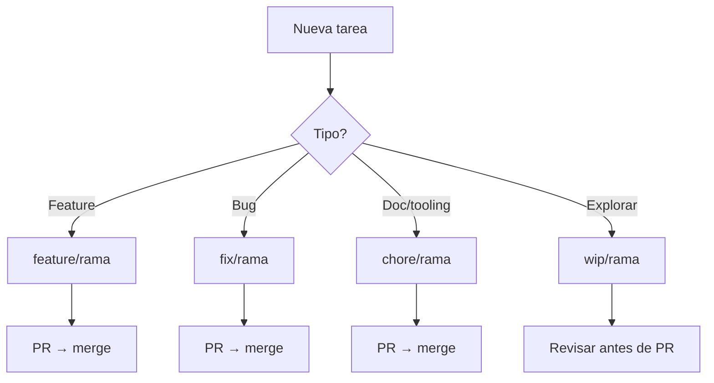

# Estrategia Git — visión Dev Lead Sr
## GGZenLab Portfolio · Trabajo con agentes Cursor

**Repo:** `https://github.com/gabrielagarayzavalia/GGZenLab-Portfolio`  
**Regla Cursor:** `.cursor/rules/git-workflow-main-protegido.mdc`  
**Guías relacionadas:**
- [GUIA-12-PASOS-GIT-GGZenLab.md](./GUIA-12-PASOS-GIT-GGZenLab.md) — playbook operativo (12 pasos)
- [GUIA-FIX-BUG-GIT-AGENTES.md](./GUIA-FIX-BUG-GIT-AGENTES.md) — bugs + chat nuevo

---

## 1. Regla de oro

| Concepto | Regla |
|----------|--------|
| **`main`** | Siempre estable; refleja lo mergeado en GitHub |
| **Ramas** | Todo trabajo nuevo en `feature/`, `fix/`, `chore/`, etc. |
| **Integración** | **Solo Pull Request** hacia `main` |
| **Prohibido** | Push directo a `main`; `git reset --hard origin/main` sin rama de respaldo |
| **Agentes** | Nunca commitear en `main`; siempre rama + PR |

```text
  main (protegido)  ◄────  merge PR  ◄────  feature/fix branch
       ▲                                        │
       │                                        │
       └──────── git pull (después del merge) ──┘
```

---

## 2. Convención de ramas

| Prefijo | Uso | Ejemplo |
|---------|-----|---------|
| `feature/` | Funcionalidad nueva | `feature/qa-job-hunter-desktop-launcher` |
| `fix/` / `bugfix/` | Corrección de bug | `fix/qa-job-hunter-env-y-shortcut` |
| `hotfix/` | Urgente post-merge en `main` | `hotfix/dashboard-crash` |
| `chore/` | Tooling, gitignore, scripts, docs | `chore/docs-guia-12-pasos` |
| `docs/` | Solo documentación | `docs/actualizar-readme-labs` |
| `wip/` | Experimento de agente; **no mergear** sin revisar | `wip/spike-mongodb-ui` |
| `rescue/` | Recuperación desde reflog | `rescue/commits-perdidos` |

**Formato:** `tipo/descripcion-corta-kebab-case`  
**Una rama = un objetivo claro** (evitar mezclar launcher + LAB-06 + gitignore en un PR confuso).

---

## 3. Flujo diario (humano o agente)



### Comandos base

```powershell
cd C:\Users\gabri\projects\GGZenLab-Portfolio
git checkout main
git pull origin main
git switch -c feature/mi-tarea    # o fix/mi-bug
git branch --show-current         # NO debe decir "main"
```

---

## 4. Reglas para agentes / chats nuevos

### Por qué chat nuevo

| Situación | Problema | Solución |
|-----------|----------|----------|
| Chat viejo | No recuerda rama ni PR | Chat nuevo + bloque inicial |
| Agente distinto | Puede tocar `main` | Regla `.mdc` + branch protection |
| Varios temas mezclados | Commits huérfanos | Una rama por tema |

### Regla en repo (always apply)

Archivo: `.cursor/rules/git-workflow-main-protegido.mdc`

### Bloque — feature (chat nuevo)

```text
Tarea en GGZenLab-Portfolio.

Reglas Git (obligatorio):
- NO commitear ni pushear a main
- Crear/usar rama: feature/<nombre-corto>
- Commit en español; push; PR a main
- No mergear el PR salvo que yo lo pida

Tarea: <descripción>
Área: <carpeta/proyecto>

Empezá: git pull main && git switch -c feature/<nombre>
```

### Bloque — bug (chat nuevo)

Ver [GUIA-FIX-BUG-GIT-AGENTES.md](./GUIA-FIX-BUG-GIT-AGENTES.md) (rama `fix/`).

---

## 5. Proteger `main` en GitHub

### Configuración (classic rule)

| Campo | Valor |
|-------|--------|
| **Branch name pattern** | `main` |
| **Require a pull request before merging** | ✅ Sí |
| **Require approvals** | ❌ No (trabajo sola) |
| **Restrict who can push** | Opcional; a veces no aparece |

**Ruta:** Repo → **Settings** → **Branches** → **Add rule** (classic)

### Error: "Awaiting approval"

| Síntoma | Causa | Solución |
|---------|-------|----------|
| PR no mergea | Require approvals activo | Edit rule → desmarcar **Require approvals** |
| Alternativa (admin) | Bypass disponible | **Merge without waiting for approval** |

### URL correcta del repo

```text
https://github.com/gabrielagarayzavalia/GGZenLab-Portfolio
```

(No confundir con otras orgs — un 404 en compare suele ser URL incorrecta.)

---

## 6. Commits y Pull Requests

### Commits

| Buena práctica | Mal práctica |
|----------------|--------------|
| Mensaje en español, el **por qué** | `fix`, `update`, `wip` |
| Un tema por commit razonable | Mezclar 3 features |
| `$m = "..."; git commit -m $m` en PowerShell | `-m` sin comillas (error pathspec) |

### Pull Requests

| Campo | Contenido |
|-------|-----------|
| **Base** | `main` |
| **Compare** | tu rama `feature/*` o `fix/*` |
| **Título** | `feature: ...` / `fix: ...` / `docs: ...` |
| **Body** | Summary (bullets) + Test plan (checkboxes) |
| **Merge** | **Squash and merge** recomendado para fixes/docs chicos |

### Tamaño ideal del PR

| Métrica | Objetivo |
|---------|----------|
| Archivos | &lt; 10–15 cuando se pueda |
| Líneas | &lt; ~400 ideal |
| Temas | 1 por PR |

---

## 7. Recuperación cuando "perdés" commits

### Diagrama — commits huérfanos (caso real)

```text
  ANTES (reset main sin rama)          DESPUÉS (recuperado)

  main ──► 19aaacf                    main ──► 19aaacf (= origin)
              │                                    ▲
              │ (reset --hard)                       │ merge PR
              ▼                                    │
  reflog: f5b1333 (launcher)  ──recover──►  feature/f5b1333
          382e930 (dashboard)       │              │
          (solo en reflog)          └──── push ────┘
```

### Pasos de recuperación

```powershell
git reflog --oneline -20
git switch -c rescue/nombre COMMIT_HASH
git push -u origin rescue/nombre
# → PR o cherry-pick a feature branch
```

| Qué buscar en reflog | Acción |
|----------------------|--------|
| Commit del launcher `f5b1333` | `git switch -c feature/... f5b1333` |
| WIP LAB-06 `3dda57e` | Rama aparte `wip/lab-06` |
| Reset a origin | `HEAD@{n}: reset: moving to origin/main` |

**Regla:** nunca `reset --hard` en `main` sin antes `git branch backup/... HEAD`.

---

## 8. WIP, stash y archivos locales

| Situación | Acción |
|-----------|--------|
| Cambios a medias, cambiás de tarea | `git stash push -m "wip descripcion"` |
| Capturas PNG en raíz | Ignoradas (`Captura*` en `.gitignore`) |
| Secretos LinkedIn | Solo `.env` local (gitignored) |
| `config.ts` con perfil | Gitignored en `qa-job-hunter` |

```powershell
git stash push -m "wip lab-06" -- docs/guides/labs/LAB-06-powershell-qa.md
git stash list
git stash pop
```

---

## 9. Modelo por tipo de trabajo



| Tipo | Rama | Chat agente | Merge |
|------|------|-------------|-------|
| Feature nueva | `feature/` | Bloque feature | PR normal |
| Bug | `fix/` | Bloque bug | PR + Test plan |
| Docs / guías | `chore/` | Indicar rama | Squash merge |
| Spike / prueba | `wip/` | "No mergear" | Manual |

---

## 10. Verificación pre-PR (Fase A — features)

Antes de abrir PR, checklist:

| # | Verificación | Comando ejemplo |
|---|--------------|-----------------|
| A.1 | Rama correcta | `git branch --show-current` |
| A.2 | Commits esperados | `git log --oneline -3` |
| A.3 | Archivos clave | `dir`, `findstr` |
| A.4 | Sin secretos | `git status` (no `.env`) |
| A.5 | Push hecho | `git ls-remote --heads origin TU-RAMA` |

```text
  Todo OK en Fase A  ──►  Crear PR (Fase C)
  Falta algo         ──►  Cherry-pick o commit faltante (Fase B)
```

---

## 11. Mapa "¿dónde estoy?"

### En `main` local (alineado con GitHub)

```text
  * main  (HEAD)
    └── último merge PR (ej. 37ca199)
    ✅ Launcher, .env, guías (si ya mergeaste)
```

### En rama feature/fix (trabajo en curso)

```text
  * feature/mi-rama  (HEAD)
    ├── tus commits
    └── base = main
    ❌ main NO tiene estos commits hasta merge PR
```

### Tras `git checkout main` sin pull

```text
  main local puede estar ATRÁS de GitHub
  → siempre: git pull origin main
```

---

## 12. Checklist cierre de sesión (con agente)

- [ ] ¿Estoy en rama `feature/` o `fix/` (no `main`)?
- [ ] ¿`git push -u origin HEAD` hecho?
- [ ] ¿PR creado o mergeado?
- [ ] ¿Secretos solo en `.env` / archivos gitignored?
- [ ] ¿`main` local actualizado tras merge (`git pull`)?
- [ ] ¿Capturas / WIP stasheados si no van al PR?

---

## Caso de estudio — QA Job Hunter (julio 2026)

### PRs mergeados

| PR | Rama | Contenido |
|----|------|-----------|
| #68 | `feature/qa-job-hunter-desktop-launcher` | Launcher .bat, dashboard, gitignore |
| #69 | `fix/qa-job-hunter-env-y-shortcut` | .env, OneDrive shortcut, regla Cursor |
| #70 | `chore/docs-guia-12-pasos` | Guía 12 pasos |
| #71 | `chore/docs-guia-fix-bug-agentes` | Guía bugs + agentes |

### Lecciones aprendidas

| Problema | Lección |
|----------|---------|
| Commits solo en reflog | Push rama **antes** de reset |
| Agente en chat nuevo sin contexto | Bloque Git al inicio |
| URL GitHub 404 | Usar `gabrielagarayzavalia/GGZenLab-Portfolio` |
| Awaiting approval | Desactivar approvals en branch rule |
| Credenciales en config | Usar `.env` + `load-dotenv.ts` |
| Escritorio OneDrive | Shortcut con `[Environment]::GetFolderPath('Desktop')` |

---

## Objetivo final (diagrama)

```text
  ANTES (caótico)                    DESPUÉS (Dev Lead Sr)

  agente → main directo              agente → feature/fix
  commits huérfanos                  push → PR → merge
  reset sin backup                   main protegido + reflog si falla
  secretos en código                 .env local
```

---

## Índice de documentos

| Documento | Para qué |
|-----------|----------|
| **Este archivo** | Estrategia completa, diagramas, tablas |
| [GUIA-12-PASOS-GIT-GGZenLab.md](./GUIA-12-PASOS-GIT-GGZenLab.md) | Ejecutar paso a paso (operativo) |
| [GUIA-FIX-BUG-GIT-AGENTES.md](./GUIA-FIX-BUG-GIT-AGENTES.md) | Bugs + chat nuevo |
| `.cursor/rules/git-workflow-main-protegido.mdc` | Regla automática agentes |

---

*GGZenLab Portfolio — Estrategia Git para trabajo solitario con agentes IA.*
