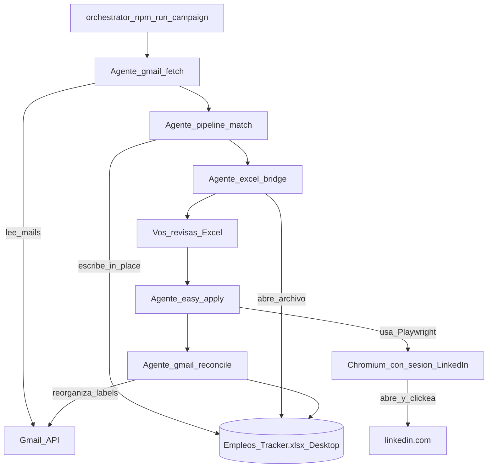

# Flujo de campaña — sub-agentes bajo qa-job-hunter

Orquestador: `npm run campaign` → `src/campaign/run-campaign.ts`.

Relacionado: [US-JH-B23 #131](https://github.com/gabrielagarayzavalia/GGZenLab-Portfolio/issues/131).

## Orden correcto

1. **Gmail fetch** — mails de sitios de empleo / labels Empleo (applied-list).
2. **Pipeline** — clasifica puestos, match con skills, escribe Excel canónico (Desktop, in-place).
3. **Abrir Excel** — revisión manual (pendientes / Notas) **antes** de apply.
4. **Easy Apply** — este repo (Playwright + sesión); hasta Done cuando corresponda.
5. **Gmail reconcile** — reorganiza labels según Excel (no abre Gmail UI ni mailto).

**LinkedIn / Playwright** no es un agente aparte: es la **herramienta** del agente Easy Apply.

Excel canónico: `OneDrive\Escritorio\Empleos_Tracker.xlsx`. Applied-list no pisa Desktop con overwrite; ver `docs/excel-writers.md` en applied-list.

## Flags

| Flag | Efecto |
|------|--------|
| `--from=fetch\|pipeline\|excel\|apply\|reconcile` | Empieza desde ese paso |
| `--apply-max=N` | Limita Easy Apply (`APPLY_MAX`) |
| `--skip-apply` | Omite Easy Apply |
| `--yes` / `-y` | Sin pausa interactiva tras Excel |

## Env

| Variable | Descripción |
|----------|-------------|
| `APPLIED_LIST_ROOT` | Path a `qa-job-applied-list` (fetch/pipeline/reconcile) |
| `EMPLEOS_TRACKER_XLSX` | Path al Excel (default OneDrive Escritorio) |
| `APPLY_MAX` | Tope de avisos en Easy Apply productivo |

## Criterios done (MVP)

- Un comando corre: fetch → pipeline → Excel (revisión) → apply → reconcile.
- No se abre Gmail ni mailto.
- Revisión Excel **antes** de Easy Apply; reconcile al final.
