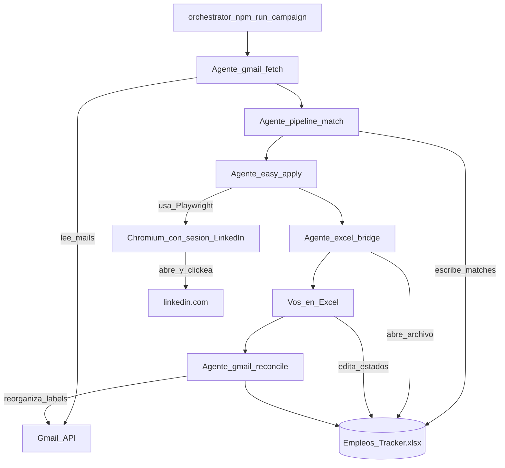

# Flujo de campaña — sub-agentes bajo qa-job-hunter

Orquestador: `npm run campaign` → `src/campaign/run-campaign.ts`.

## Orden correcto (no el README antiguo de applied-list)

1. **Gmail fetch** — mails de sitios de empleo / labels Empleo.
2. **Pipeline** — clasifica puestos, match con skills, escribe `Empleos_Tracker.xlsx`.
3. **Easy Apply** — postulaciones LinkedIn (Playwright + sesión); hasta Done cuando corresponda.
4. **Abrir Excel** — postulación manual y actualización de estados.
5. **Gmail reconcile + Excel** — lee tus cambios en Excel y **reorganiza labels** en Gmail (no abre Gmail UI ni mailto).

**LinkedIn / Playwright** no es un agente aparte: es la **herramienta** del agente Easy Apply (igual que Gmail API para fetch/reconcile).

## Flags

| Flag | Efecto |
|------|--------|
| `--from=fetch\|pipeline\|apply\|excel\|reconcile` | Empieza desde ese paso |
| `--apply-max=N` | Limita Easy Apply (`APPLY_MAX`) |
| `--skip-apply` | Omite Easy Apply |
| `--yes` / `-y` | Sin pausa interactiva tras Excel |

## Env

| Variable | Descripción |
|----------|-------------|
| `APPLIED_LIST_ROOT` | Path a `qa-job-applied-list` (fetch/pipeline/reconcile) |
| `EMPLEOS_TRACKER_XLSX` | Path al Excel (default OneDrive Escritorio) |
| `APPLY_MAX` | Tope de avisos en Easy Apply productivo |

## Criterios done (MVP)

- Un comando corre: fetch → pipeline → apply → abrir Excel → (pausa) → reconcile.
- No se abre Gmail ni mailto.
- Reconcile corre **después** de la edición manual en Excel.
