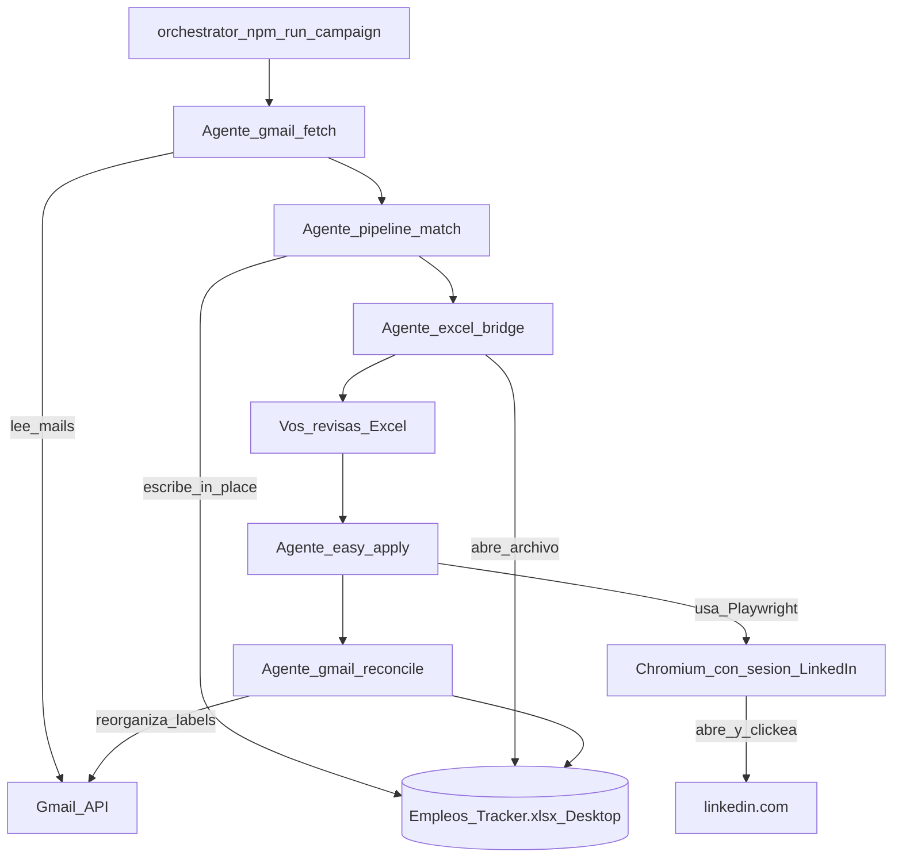

# Flujo de campaña — sub-agentes bajo qa-job-hunter

Orquestador: `npm run campaign` → `src/campaign/run-campaign.ts`.

Relacionado: [US-JH-B23 #131](https://github.com/gabrielagarayzavalia/GGZenLab-Portfolio/issues/131).

## Orden correcto (canónico)

1. **Discovery (default: Gmail API)** — `gmail:fetch` en applied-list (labels Empleo / Sitios-de-empleo).
2. **Pipeline** — ingest URLs → scrape **detalle JD** LinkedIn (solo URLs del mail) → match rules → Excel Desktop in-place.
3. **Abrir Excel** — revisión manual (pendientes / Notas) **antes** de apply.
4. **Easy Apply** — este repo (Playwright + sesión); hasta Done cuando corresponda.
5. **Gmail reconcile** — reorganiza labels según Excel (no abre Gmail UI ni mailto).

**LinkedIn / Playwright** no es un agente aparte: es la **herramienta** del agente Easy Apply (y del scrape de **detalle** JD en applied-list).

### Qué NO es el discovery diario

| Comando | Rol |
|---------|-----|
| `npm run scrape` → `2-scrape-jobs.ts` | LinkedIn **search** (keywords). Opt-in con `DISCOVERY=linkedin_search`. Hoy trae ruido; ver backlog abajo. |
| `npm run analyze` + Ollama | Match CV↔JD solo en el path hunter scrape+analyze. El pipeline Gmail usa **rules** (`match-jobs.ts`), no Ollama. |
| `scrape-linkedin.ts` (applied-list) | Detalle de avisos **ya** descubiertos por Gmail — sí forma parte del pipeline. |

Si la cola Easy Apply está vacía: **correr Gmail fetch/pipeline**, no `npm run scrape`.

Excel canónico: `OneDrive\Escritorio\Empleos_Tracker.xlsx`. Applied-list no pisa Desktop con overwrite; ver `docs/excel-writers.md` en applied-list.

### Externos

`Canal=Externo` = sin Easy Apply. Flujo: Excel abierto → postulación manual → marcar **Enviada**. No se automatiza el portal.

## Flags

| Flag | Efecto |
|------|--------|
| `--from=fetch\|pipeline\|excel\|apply\|reconcile` | Empieza desde ese paso |
| `--apply-max=N` | Limita Easy Apply / dry-run (`APPLY_MAX` / `DRY_RUN_MAX`) |
| `--skip-apply` | Omite Easy Apply |
| `--dry-run` | Sin abrir Excel mid; `easy-apply:dry-run`; Excel solo al final post-reconcile |
| `--yes` / `-y` | Sin pausa interactiva tras Excel (CI). En uso humano preferí **sin** `--yes` para revisar Excel. |

## Env

| Variable | Descripción |
|----------|-------------|
| `APPLIED_LIST_ROOT` | Path a `qa-job-applied-list` (fetch/pipeline/reconcile) |
| `EMPLEOS_TRACKER_XLSX` | Path al Excel (default OneDrive Escritorio) |
| `APPLY_MAX` | Tope de avisos en Easy Apply productivo |
| `CAMPAIGN_DRY_RUN` | `1` = mismo que `--dry-run` |
| `DISCOVERY` | `gmail` (default) \| `linkedin_search` (opt-in; imprime aviso de calidad) |

## Criterios done (MVP)

- Un comando corre: fetch → pipeline → Excel (revisión) → apply → reconcile.
- No se abre Gmail ni mailto.
- Revisión Excel **antes** de Easy Apply; reconcile al final.
- Discovery default = Gmail; LinkedIn search no se dispara por cola vacía.

## Backlog: LinkedIn search scrape

Mejorar `src/2-scrape-jobs.ts` (filtros Easy Apply / geo / menos cards basura) en PR aparte — **fuera del camino Gmail** hasta review. Ver [docs/backlog-linkedin-search-scrape.md](./backlog-linkedin-search-scrape.md).
