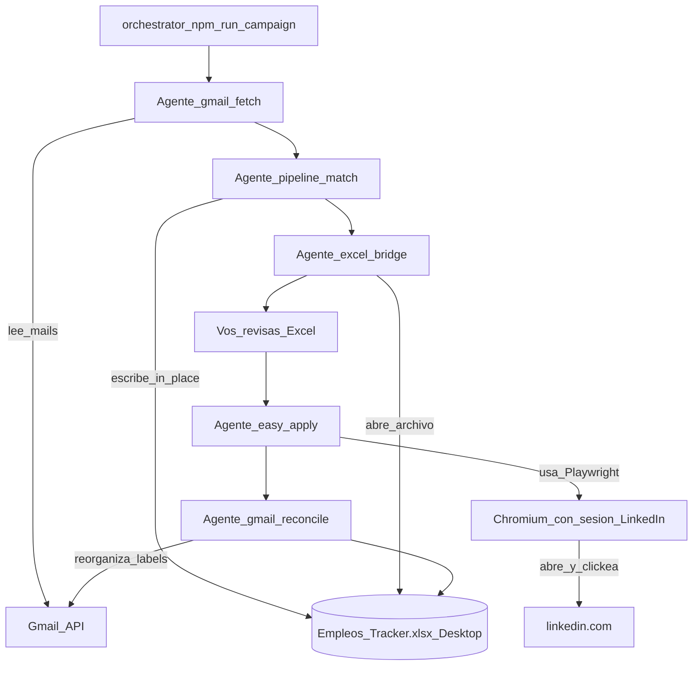

# Flujo de campaña — sub-agentes bajo qa-job-hunter

Orquestador: `npm run campaign` → `src/campaign/run-campaign.ts`.

Relacionado: [US-JH-B23 #131](https://github.com/gabrielagarayzavalia/GGZenLab-Portfolio/issues/131).

## Orden correcto (canónico)

1. **Discovery (default: Gmail API)** — `gmail:fetch` en applied-list (labels Empleo / Sitios-de-empleo).
2. **Pipeline** — ingest URLs → scrape **detalle JD** LinkedIn (solo URLs del mail) → match rules → Excel Desktop in-place.
3. **Abrir Excel** — revisión manual (pendientes / Notas) **antes** de apply.
4. **Easy Apply** — este repo (Playwright + sesión); hasta Done cuando corresponda.
5. **Gmail reconcile** — reorganiza labels según Excel (no abre Gmail UI ni mailto).


```mermaid
flowchart TB
  orch[orchestrator_npm_run_campaign]

  A1[Agente_gmail_fetch]
  A2[Agente_pipeline_match]
  A4[Agente_excel_bridge]
  Human[Vos_revisas_Excel]
  A3[Agente_easy_apply]
  A5[Agente_gmail_reconcile]

  Excel[(Empleos_Tracker.xlsx_Desktop)]
  GmailAPI[Gmail_API]
  Browser[Chromium_con_sesion_LinkedIn]

  orch --> A1
  A1 -->|lee_mails| GmailAPI
  A1 --> A2
  A2 -->|escribe_in_place| Excel
  A2 --> A4
  A4 -->|abre_archivo| Excel
  A4 --> Human
  Human --> A3
  A3 -->|usa_Playwright| Browser
  Browser -->|abre_y_clickea| LinkedInWeb[linkedin.com]
  A3 --> A5
  A5 -->|reorganiza_labels| GmailAPI
  A5 --> Excel
```

**LinkedIn / Playwright** no es un agente aparte: es la **herramienta** del agente Easy Apply (y del scrape de **detalle** JD en applied-list).

### Qué NO es el discovery diario

| Comando | Rol |
|---------|-----|
| `npm run scrape` → `2-scrape-jobs.ts` | LinkedIn **search** (keywords). Opt-in con `DISCOVERY=linkedin_search`. Hoy trae ruido; ver backlog abajo. |
| `npm run analyze` + Ollama | Match CV↔JD solo en el path hunter scrape+analyze. El pipeline Gmail usa **rules** (`match-jobs.ts`), no Ollama. |
| `scrape-linkedin.ts` (applied-list) | Detalle de avisos **ya** descubiertos por Gmail — sí forma parte del pipeline. |

Si la cola Easy Apply está vacía: **correr Gmail fetch/pipeline**, no `npm run scrape`.

Excel canónico: `OneDrive\Escritorio\Empleos_Tracker.xlsx`. Applied-list no pisa Desktop con overwrite; ver `docs/excel-writers.md` en applied-list.

### Externos

`Canal=Externo` = sin Easy Apply. Flujo: Excel abierto → postulación manual → marcar **Enviada**. No se automatiza el portal.

## Toggles y variables de entorno

Referencia operativa de **todo lo que hoy controla comportamiento** sin `features.json` centralizado.
Estrategia de flags a futuro: [`docs/feature-config-strategy.md`](./feature-config-strategy.md).

### Reglas rápidas

| Regla | Detalle |
|-------|---------|
| Spikes | Script separado + env opt-in (ej. `discover-notifications.ts`); no cablear a `run-campaign` hasta go/no-go |
| Camino diario | `DISCOVERY=gmail` (default); **no** usar `linkedin_search` como fallback |
| Excel mid-campaña | Default **no abrir**; `OPEN_EXCEL=1` al cierre productivo; tracker web es canónico (B-38) |
| Fixes sprint-2 | Merge directo; no flag permanente |

### CLI — `npm run campaign`

Orquestador: `src/campaign/run-campaign.ts`.

| Flag | Efecto |
|------|--------|
| `--from=fetch\|pipeline\|excel\|apply\|reconcile` | Empieza desde ese paso |
| `--apply-max=N` | Hasta **N intentos** de apply/dry-run (sin EA → sigue; si no hay más pendientes, termina antes) |
| `--skip-apply` | Omite Easy Apply |
| `--dry-run` | Sin abrir Excel mid; `easy-apply:dry-run`; Excel solo al final post-reconcile |
| `--yes` / `-y` | Sin pausa interactiva tras Excel (CI). En uso humano preferí **sin** `--yes` para revisar Excel |

### Env — campaña y discovery

| Variable | Default | Comportamiento |
|----------|---------|----------------|
| `CAMPAIGN_DRY_RUN` | — | `1` / `true` = mismo que `--dry-run` |
| `DISCOVERY` | `gmail` | `gmail` = fetch Gmail API. `linkedin_search` = opt-in; imprime aviso de calidad; **no** camino diario |
| `NOTIFICATIONS_DISCOVERY` | `1` (con gmail) | `0` = omitir post-fetch LinkedIn Notifications en campaña |
| `NOTIFICATIONS_LOOKBACK_HOURS` | `24` | Ventana horas (max 336) para notifications discovery |
| `NOTIFICATIONS_MAX_ITEMS` | `5` | Tope ítems en campaña |
| `APPLIED_LIST_ROOT` | auto | Path a `qa-job-applied-list` (fetch / pipeline / reconcile) |
| `APPLY_MAX` | — | Tope avisos Easy Apply productivo (equiv. `--apply-max`) |

### Env — Easy Apply (productivo y dry-run)

| Variable | Default | Comportamiento |
|----------|---------|----------------|
| `DRY_RUN_MAX` | `10` | Máx. jobs en `easy-apply:dry-run` |
| `DRY_RUN_ALL` | — | `1` = no parar tras primer éxito dry-run |
| `DRY_RUN_JOB_ID` | — | Forzar un jobId en dry-run |
| `DRY_RUN_JOB_TITLE` / `DRY_RUN_JOB_COMPANY` | — | Metadata cuando se fuerza jobId |
| `DRY_RUN_CONFIG_CV` | — | Forzar CV en dry-run (`resume-match`, `fill-answers`) |
| `APPLY_JOB_ID` | — | Forzar un job en apply productivo |
| `APPLY_JOB_TITLE` / `APPLY_JOB_COMPANY` | — | Metadata cuando se fuerza `APPLY_JOB_ID` |
| `OPEN_EXCEL` | off | `1` / `true` = abrir Excel al **cierre** productivo (`post-run.ts`) |
| `EMPLEOS_TRACKER_XLSX` | Desktop | Path al Excel tracker |
| `EXCEL_DESKTOP_DIR` | — | Directorio Desktop si Excel no está en OneDrive default |
| `COVER_LETTER_PDF` | default interno | Path PDF cover letter |
| `PERF_TEST` | — | Modo perf tests apply (`timing.ts`) |
| `PERF_FAIL_HARD` | — | `0` / `1` = fallar duro en perf tests |

Detalle flujo apply: [`docs/easy-apply-flow.md`](./easy-apply-flow.md).

### Env — scrape / analyze (path hunter legacy)

| Variable | Default | Comportamiento |
|----------|---------|----------------|
| `DISCOVERY` | — | En `2-scrape-jobs.ts`: requiere `linkedin_search` explícito para scrape search |
| `LLM_PROVIDER` | auto | `regex` \| `ollama` \| `anthropic` (`llm-client.ts`) |
| `ANTHROPIC_API_KEY` | — | Si existe → provider anthropic |
| `OLLAMA_URL` / `OLLAMA_MODEL` | localhost | Ollama para analyze local |

### Env — dashboard y tracker

| Variable | Default | Comportamiento |
|----------|---------|----------------|
| `DASHBOARD_PORT` | `3847` | Puerto `serve-dashboard.ts` |
| `MONGODB_URI` | docker local | Mongo para tracker / jobs |
| `TRACKER_DUAL_WRITE` | `1` | Tras `run-pipeline` OK: sync `matched.json` → Mongo `applications`. `0` = solo Excel |
| `TRACKER_DUAL_WRITE_PIPELINE` | — | Alias legacy de `TRACKER_DUAL_WRITE` |
| `OPEN_DESKTOP_EXCEL` | off (futuro B-38-3) | Abrir Excel mid-campaña; hoy usar `OPEN_EXCEL` al cierre |

**Dual-write pipeline (B-38-5):** lee `APPLIED_LIST_ROOT/data/matched.json` (mismo input que `sync-excel.ts` en applied-list). Umbral sync: **65** (Excel/pipeline). Dashboard match-jobs futuro (#311): **70** — no filtra este sync. Manual: `npm run tracker:sync-pipeline`. Estados protegidos (Enviada, Cerrado, Descartado, Duplicado, Stand-by, Borrador abierto, A-pendiente, A-realizado) no se pisan; bot nunca escribe Descartado.

### Dashboard `/api/health` — features hardcoded

Hoy **no** leen env ni JSON; objeto fijo en `serve-dashboard.ts`:

| Key | Valor actual | UI / API |
|-----|--------------|----------|
| `configQuestions` | `true` | `/config#preguntas` |
| `configSources` | `true` | Config fuentes |
| `configPuestos` | `true` | Config puestos |
| `configEmpleo` | `true` | Config empleo |
| `configCvs` | `true` | Config CVs |
| `runApply` | `true` | Botón apply desde dashboard |
| `tracker` | `true` | Ruta `/tracker` |

Unificación futura: [#289 B-39](https://github.com/gabrielagarayzavalia/GGZenLab-Portfolio/issues/289) + `local/features.json`.

### Scripts spike / opt-in (fuera de campaña)

| Script / env | Rol |
|--------------|-----|
| `npm run discover:notifications` + `--dry-run` | Spike B-37; no en pipeline diario hasta go |
| `NOTIFICATIONS_LOOKBACK_HOURS` | También en script standalone |
| `npm run discover:indeed` | Spike Indeed; `INDEED_KEYWORDS`, `INDEED_LIMIT`, `FORCE_SOURCE=1` |
| `SMOKE_INDEED_LIVE=1` | Smoke Indeed con browser |

## Criterios done (MVP)

- Un comando corre: fetch → pipeline → Excel (revisión) → apply → reconcile.
- No se abre Gmail ni mailto.
- Revisión Excel **antes** de Easy Apply; reconcile al final.
- Discovery default = Gmail; LinkedIn search no se dispara por cola vacía.

### Verificación dual-write pipeline (B-38-5)

```bash
cd projects/qa-job-hunter
docker compose up -d

# Campaña: solo pipeline + sync Mongo (sin apply)
TRACKER_DUAL_WRITE=1 npm run campaign -- --from=pipeline --skip-apply --yes

# O sync manual si matched.json ya existe
npm run tracker:sync-pipeline

npm run test:tracker
npm run dashboard   # http://localhost:3847/tracker
```

Re-ejecutar `tracker:sync-pipeline` no debe pisar filas con estado protegido (Enviada, Descartado, etc.) en Mongo.

## Backlog: LinkedIn search scrape

Mejorar `src/2-scrape-jobs.ts` (filtros Easy Apply / geo / menos cards basura) en PR aparte — **fuera del camino Gmail** hasta review. Ver [docs/backlog-linkedin-search-scrape.md](./backlog-linkedin-search-scrape.md).
