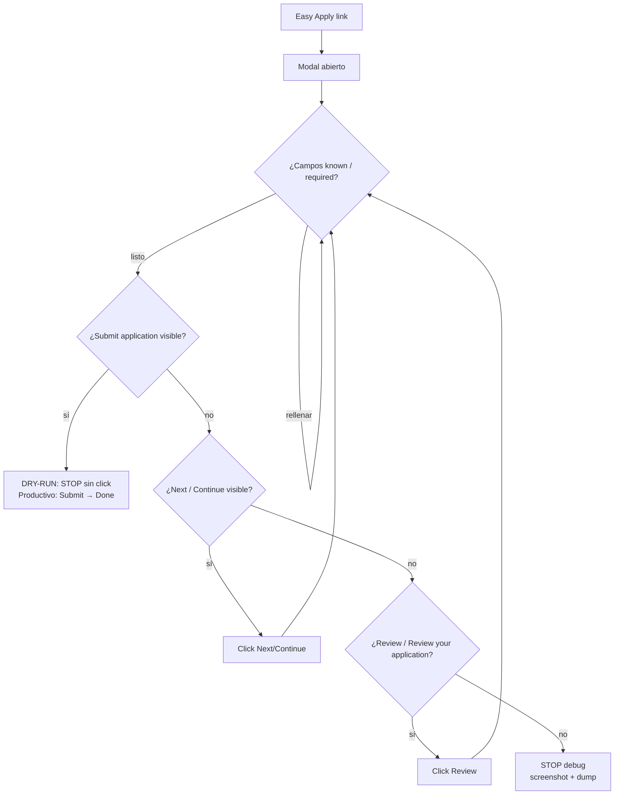
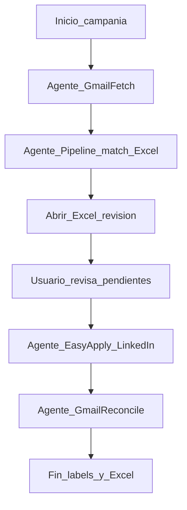

# Easy Apply — Flujo, selectores y plantilla de pasos (B17-01)

Spike **JH-T-B17-01** de la story **US-JH-B17** (_Easy Apply automatizado desde grabación_).

> **Estado:** primera grabación registrada en `recordings/easy-apply/simple-apply.spec.ts`
> (multistep + radio; UI EN). Textos canónicos en `src/apply/canonical-text.ts`.
> Seed de respuestas: `src/apply/apply-answers.example.json`.

---

## 1. Cómo grabar

Requisito: `npm run login` → `session/linkedin-session.json`.

**No uses `<>` alrededor de la URL** (en Windows son redirección).

```bash
# Desde projects/qa-job-hunter
npm run playwright:ide -- --url=https://www.linkedin.com/jobs/view/JOB_ID --label=simple-apply
npm run playwright:ide -- --url=https://www.linkedin.com/jobs/view/JOB_ID --label=multistep
npm run playwright:ide -- --url=https://www.linkedin.com/jobs/view/JOB_ID --label=preguntas
```

- Codegen carga la sesión (`--load-storage`) y escribe en `recordings/easy-apply/<label>.spec.ts`.
- Tras cerrar Codegen, revisá el archivo (sesión relativa, dry-run, textos genéricos).

---

## 2. Riesgos operativos (acordados)

### 2.1 JobId destructivo
Un **Submit real** en LinkedIn “quema” ese aviso para re-pruebas. Después de un apply real, tomar un **job nuevo** de la hoja/CSV del pipeline (`output/jobs-result.csv`).

### 2.2 Estados en Excel (`ApplyStatus`)

| Estado | Final | Cuándo |
|---|---|---|
| `pendiente` | No | Default; sin Easy Apply; dry-run hasta Submit |
| `enviada` | No* | Applied en UI o Submit+Done en productivo |
| `cerrada` | Sí | Marcado manual / negocio — no se pisa |
| `descartada` | Sí | Marcado manual / negocio — no se pisa |

\* `enviada` no pisa `cerrada` ni `descartada`.

### 2.3 Dry-run (pruebas) vs productivo

```bash
npm run easy-apply:dry-run   # pruebas: hasta Submit, SIN click; Excel sigue pendiente
npm run easy-apply           # productivo: Submit + Done → Excel enviada
```

- Cola: `output/apply/apply-queue.csv` (+ sync `jobs-result.csv`).
- Applied / **Application submitted** / Ya postulaste → **enviada** (salvo `cerrada`/`descartada`).
- Aviso **ya no acepta** / no disponible / closed → **cerrada** → siguiente.
- Sin Easy Apply (y no closed/applied) → **sigue pendiente** → siguiente.
- Dry-run + Easy Apply → ver Submit, no clickear → **pendiente**.
- Si hay Easy Apply y **no entra al modal** → **STOP** de toda la corrida (exit 2); no seguir al siguiente.
- Si **Next no avanza** (required) en **dry-run** → registra campos en dump + **Notas**, estado **pendiente**, resume limpio (no exit 3). En productivo: captura + pendiente según Strategy.
- Contact precargado (email/tel/código) → dry-run hace **Next sin fill pesado**.
- Pseudo-fill: Location/comuna 9 → tipar **Liniers**; Country → **Argentina**; remuneración → **2750** USD / **3500000** ARS; start → **Immediately** / **Inmediatamente**; ciudad libre → **Buenos Aires city** / **Ciudad Autonoma de Buenos Aires**.
- **Cover letter:** upload `intro-GGZ.pdf` (`COVER_LETTER_PDF` / path en `canonical-text.ts`).
- **Summary:** borrar default y pegar texto **QA Analyst** o **QA Automation** según el título del aviso (`resolveApplicationSummary`).
- **CV:** si el default es la cover (`intro-GGZ`) o el CV incorrecto → click **`Show N more resumes`**, luego radio `QA_Analyst` / `QA_Automation`. Nunca subir la cover letter al input de resume.
- **Country** = Argentina; **City (dropdown LinkedIn)** = Liniers, Comuna 9 (CABA no está en lista); **City texto** = `Ciudad Autónoma de Buenos Aires, Argentina`.
- **(Country, city)** / preferred location = `Argentina, Ciudad Autónoma de Buenos Aires`.
- **Dónde vivís/trabajar (texto):** EN `Buenos Aires city, Argentina` · ES `Ciudad Autonoma de Buenos Aires, Argentina`.
- **English proficiency:** escala numérica (1–10 / 10+ / 8–9) → **máximo** (50 años de uso); CEFR/texto → `Advanced (C1)`. Nunca meter texto CEFR en dropdown numérico.
- **Where did you learn about…** = LinkedIn (select o typeahead + click).
- **Prefill:** si el campo ya trae respuesta, **no pisar** — excepto **summary** (siempre pisar) y cover letter (upload).
- **Skills Sí/No:** si la skill está en `src/apply/my-skills.ts` → **Yes/Sí**; si no → **No** (Deequ/GE → No + pendiente). También en **`<select>`**.
- **Híbrida / Programación y scripting:** Sí (radio o select). Capgemini/Macro ES.
- **Years of experience por skill:** input o dropdown numérico (`skills-years.ts` + clamp a `10+`); sin mapa → Excel **Pendiente** + Notas, cerrar, siguiente.
- **Aviso cerrado** (`No longer accepting applications`): Excel **cerrada** al toque (sin esperar Easy Apply) → siguiente.
- **Consent checkbox:** click; si no queda marcado → pendiente + siguiente. **Top choice / Follow company:** no tocar (spikes en BACKLOG).
- **Assessment/honeypot:** pendiente + Notas con **assessment** en negrita; siguiente.
- **Preguntas nuevas / dropdown sin regla:** se acumulan en Excel columna **Notas** + `output/apply/new-questions-latest.json` al cerrar la corrida.
- **Performance waits (B24 / #143):** constantes en `src/apply/timing.ts`; doc [`easy-apply-perf.md`](./easy-apply-perf.md). Preferir settle condicionado (loader) a sleeps 1.5–2.5s.
- **Campos desconocidos (EA-SPIKE-04 / #156 Strategy):** política en [#154](https://github.com/gabrielagarayzavalia/GGZenLab-Portfolio/issues/154); código `src/apply/unknown-field-strategy.ts` (patrón [Strategy](https://refactoring.guru/es/design-patterns/strategy)). Required desconocido vacío → **pendiente + Notas + siguiente** (no quemar 8 pasos); optional → solo Notas; Follow/top choice → no tocar; typeahead → reintentos existentes. **Nunca inventar** respuestas.
- Cierre productivo: export Excel **sin abrir** el archivo (salvo `OPEN_EXCEL=1`).
- **Antes de Next/Review**: si hay campos obligatorios vacíos → **no clickear** (evita modal Save/Discard).
- **Save this application?**
  - **Dry-run (prueba):** → **Discard** y **salir** (cerrar sin guardar ni enviar).
  - **Productivo:** → **Save** → buscar **Submit** → click → Excel `enviada` **aunque no haya Done** → intentar Done si aparece → siguiente puesto. Al terminar la cola: **export Excel + abrir Excel** (sin mailto / sin abrir Gmail; reintenta si Excel está abierto).
  - **Typeahead mandatorio** (Location, etc.): si falla validación → click en el campo + reescribir hasta ver dropdown, **hasta 3 veces**; si sigue fallando → cerrar modal y dejar para otra estrategia.
- **Sin reintentos hard:** modal que no abre → STOP (exit 2). Dry-run con campos sin respuesta → soft (Notas + pendiente). Stuck/no-Submit tras N pasos → STOP (exit 4).
- **Capturas de error (dry-run):** `output/apply/screenshots/<jobId>-dryrun-<tag>.png` (+ dump JSON en `output/apply/required-fields-*.json`).
- **Fingerprint de paso:** solo modal Easy Apply (nunca `<main>` del aviso); si no, Next válido se marca `stuck` en falso.
- Productivo + Easy Apply → Submit → **Done** → **enviada**.
- Idioma base LinkedIn: **inglés**.

Env dry-run: `DRY_RUN_MAX=10`, `DRY_RUN_ALL=1`.

### 2.2b Robustez de UI (maximize / wait / scroll)

Antes de clicks Easy Apply:

1. **Ventana maximizada** (`--start-maximized` + CDP) — evita misses por viewport chico.
2. **Espera de página/modal listos** (`waitForJobPageReady` / `waitForEasyApplyModalReady`) — shell LinkedIn + red quieta + loader oculto.
3. **Scroll del form al final** en cada paso del modal — revela campos fuera de pantalla; vuelca inventario required+optional a `output/apply/field-inventory-*.json` para ampliar `PSEUDO_ANSWERS` (cada aviso puede traer preguntas distintas).
4. **waitFor en campos que fallan** — igual que Location: `waitFor` visible/enabled antes de tipar; si hay lista predictiva, `waitFor` de opciones (hasta 3 reintentos). Aplica a Location, remuneración, LinkedIn/Portfolio, etc.

Assessment falso: la detección **solo** mira texto del modal (nunca `main`/JD/perfil).

### 2.3 Preguntas Sí/No
Aparecen de forma variable. Heurística: defaults + patrones en `apply-answers.example.json`; preguntas desconocidas → registrar en `output/apply/apply-answers.json` (gitignore) para reutilizar (motor completo = B17-2 / B17-4).

### 2.4 CV / resumen / cover letter — opcionales
Pueden **no aparecer**. Si el control está visible → rellenar con textos genéricos de `canonical-text.ts` (**sin** nombre de la empresa solicitante). Si no → skip.

---

## 3. Variante observada (grabación real)

Archivo: `recordings/easy-apply/simple-apply.spec.ts`  
Job: `4438016042` · UI: inglés · Variante: **multistep + pregunta radio** (no “simple” 1-clic).

Secuencia observada:

1. `getByRole('link', { name: 'Easy Apply to this job' })`
2. `Continue to next step` / `Next` × N (mientras exista)
3. Radio / texto `Yes` (pregunta del empleador, si aparece)
4. Cuando **ya no hay Next** → botón/link **`Review`** / `Review your application`
5. Pantalla de revisión → **`Submit application`** → `Done` _(Done solo apply real; dry-run para en Submit)_

En ese aviso **no** pidieron CV picker / summary / cover (opcionales ausentes).

### Diagrama de flujo (orden de botones del modal)



Orden canónico del footer:

**Next/Continue** → (cuando desaparece) → **Review** → (pantalla review) → **Submit application** → **Done**

Patrón de prueba generalizado:

```
abrir Easy Apply
→ (opcional) CV / resumen / cover
→ mientras haya Next/Continue: fill conocidos → Next
→ si no hay Next pero hay Review: click Review
→ al ver Submit application: STOP (dry-run) | Submit+Done (productivo)
```

---

## 4. Selectores: estables vs frágiles

Priorizar `getByRole` / `aria-label` (EN observados + fallbacks ES).

| Elemento | Selector | Estabilidad | Nota |
|---|---|---|---|
| Easy Apply | `getByRole('link', { name: 'Easy Apply to this job' })` | Estable | **Es link, no button** (codegen Macro/GLOBAL HR) |
| Easy Apply (fallback) | otros `link`/`button` con Easy Apply | Heurística | Solo si falla el primario |
| Continuar / Next | `button` **o** `link` (`modal-controls.ts`) | Estable | Mientras exista, avanzar con esto |
| Review | `Review` / `Review your application` (button o link) | Estable | **Aparece cuando ya no hay Next**; antes de Submit |
| Enviar / Submit | `Submit application` | Estable | Dry-run: detectar, no click; viene **después** de Review |
| Done | idem Done/Listo | Estable | Post-submit |
| Yes/No | `getByText(/^Sí$\|^Yes$/i)` | Media | Heurística; ampliar con apply-answers |
| Modal | `getByRole('dialog')` | Estable | |
| Cover/summary | `dialog textarea` | Media | **Opcional** |
| CV picker | (variable por UI LinkedIn) | Frágil | **Opcional** |
| Primario genérico | `button.artdeco-button--primary` | Frágil | Último recurso |

---

## 5. Textos canónicos

Fuente: `src/apply/canonical-text.ts`

- `APPLICATION_SUMMARY` — resumen genérico
- `COVER_LETTER_DEFAULT` — cover genérica
- `RESUME_LABEL_HINT` — criterio de elección de CV

`cover-letter.ts` usa `COVER_LETTER_DEFAULT` como fallback final.

---

## 6. Plantilla de pasos (input B17-3)

```ts
type StepAction = "goto" | "click" | "fill" | "select" | "check" | "expect" | "screenshot";

interface FlowStep {
  action: StepAction;
  selector?: string;
  value?: string;
  valueRef?: string;
  optional?: boolean;
  note?: string;
}
```

Ejemplo alineado a la grabación (dry-run):

```json
{
  "variant": "multistep",
  "jobId": "4438016042",
  "dryRun": true,
  "steps": [
    { "action": "click", "selector": "getByRole('link', { name: 'Easy Apply to this job' })" },
    { "action": "fill", "selector": "dialog textarea[summary]", "valueRef": "summary", "optional": true },
    { "action": "fill", "selector": "dialog textarea[cover]", "valueRef": "coverLetter", "optional": true },
    { "action": "click", "selector": "Continue to next step", "optional": true, "note": "repetir mientras exista" },
    { "action": "check", "selector": "Sí|Yes", "valueRef": "yesNo", "optional": true },
    { "action": "click", "selector": "Review your application", "optional": true },
    { "action": "expect", "selector": "Submit application", "note": "dry-run: NO click" }
  ]
}
```

---

## 7. Riesgos ToS (resumen B17-7)

- Automatizar postulaciones puede violar ToS de LinkedIn: límites, delays (B17-5), dry-run por defecto.
- `session/` y `.env` nunca se commitean.
- Las grabaciones no deben llevar path absoluto de sesión ni datos personales sensibles.

---

## 8. Checklist del spike

- [x] Primera grabación real → `recordings/easy-apply/simple-apply.spec.ts` (multistep + radio)
- [x] Selectores EN documentados + dry-run pre-Submit
- [x] Textos canónicos genéricos + seed `apply-answers.example.json`
- [ ] Caso “simple” puro (1 paso, sin preguntas) — grabar cuando aparezca
- [ ] Caso `preguntas` dedicado (varios tipos de control) — grabar aparte
- [ ] Motor de aprendizaje yes/no completo (B17-2 / B17-4)

---

## 9. Campaña completa (orden canónico)

Easy Apply es **un sub-agente** del flujo de campaña. El orden correcto (**reconcile al final**):



| Paso | Agente | Comando |
|------|--------|---------|
| 1 | Gmail fetch | `npm run agent:gmail-fetch` (vía applied-list) |
| 2 | Pipeline match → Excel | `npm run agent:pipeline` |
| 3 | Excel bridge + revisión | abre `Empleos_Tracker.xlsx` (Escritorio) — revisá pendientes/Notas |
| 4 | Easy Apply (Playwright) — **canónico este repo** | `npm run easy-apply` |
| 5 | Gmail reconcile | `npm run agent:gmail-reconcile` — **reorganiza labels**, no abre Gmail UI |

Orden alineado a #131: fetch → pipeline → Excel (revisión) → apply → reconcile.

Orquestador:

```bash
# Desde projects/qa-job-hunter
npm run campaign
npm run campaign -- --from=apply --apply-max=2
npm run campaign -- --skip-apply --from=excel
```

- Env: `APPLIED_LIST_ROOT` → path a `qa-job-applied-list`; `APPLY_MAX` / `--apply-max`.
- Cierre productivo: **solo** export + abrir Excel (`src/apply/post-run.ts`). Sin mailto.
- Detalle de sub-agentes: [`agents/README.md`](../agents/README.md).
- Doc dedicada: [`docs/campaign-flow.md`](./campaign-flow.md).
