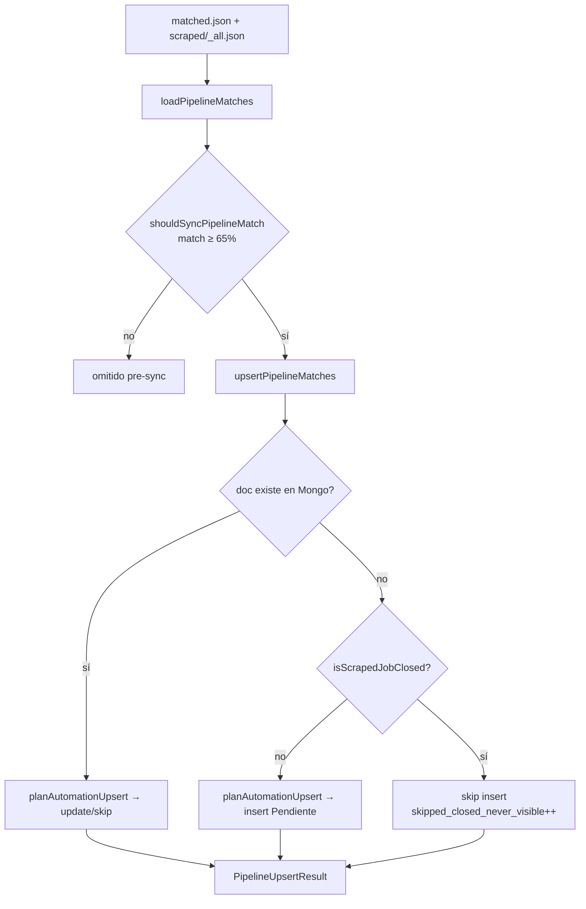

# Spike — no ingestar avisos cerrados sin historial en dashboard

**Issue:** [#408](https://github.com/gabrielagarayzavalia/GGZenLab-Portfolio/issues/408) · **Fecha:** 2026-08-01 · **Rama:** `spike/b38-closed-never-visible`

## Problema

El pipeline Gmail/notificaciones puede **insertar** en Mongo avisos que al primer scrape ya están cerrados (`jobClosed` / `acceptingApplications: false`). El dashboard los oculta por defecto (`isVisibleMatchApplication`), pero quedan en DB y ensucian conteos/filtro «Cerrado».

**Regla PO:** aviso descubierto fuera de la lista visible y cerrado al primer scrape → **no insertar**.

---

## Preguntas del spike

### 1. ¿Opción A, B o C? ¿Híbrido?

**Decisión: Opción C** (lógica pura, sin columna nueva).

| Opción | Veredicto |
|--------|-----------|
| **A** `everVisibleOnDashboard` | Modela explícitamente «estuvo en dashboard», pero requiere migración/backfill y más superficie (índice, seed, lógica de flip a `true`). Overkill para la regla PO actual. |
| **B** `discoverySource` + regla compuesta | Buena trazabilidad futura, pero no distingue «estuvo abierto en run anterior» vs «cerrado on arrival» sin estado adicional. |
| **C** `shouldIngestClosedApplication` | **Cero migración.** La regla PO es exactamente «sin doc previo + cerrado al scrape → skip insert». Jobs insertados abiertos que luego cierran siguen en DB (ocultos por umbral/display) — aceptable y alineado con #373. |

**Híbrido A+C descartado** en este PR: C cubre el 100 % del caso PO sin deuda de schema. Si más adelante hace falta analytics de «ever visible», se puede añadir A sin romper C.

### 2. ¿Solo insert o también purgar legacy?

**Solo insert.** No purgar ni archivar documentos legacy cerrados nunca visibles en este PR. El copy legacy de #373 sigue como red de seguridad para docs ya existentes.

### 3. ¿Contador «Cerrado» y filtro #373 para docs con historial?

**Sin cambios.** Avisos que **sí** estuvieron en dashboard (insert abiertos, feedback, `inLatestAnalysis`, estados protegidos) y luego cierran → update normal de `jobClosed`; siguen accesibles vía filtro «Cerrado» y copy legacy.

### 4. ¿Excel / reconcile / Easy Apply fuera del gate?

**Sí, fuera de alcance.** Gate solo en `upsertPipelineMatches` (pipeline Gmail/notificaciones → Mongo). Reconcile y Easy Apply tienen sus propios writers (`planReconcileUpsert`, `planEasyApplyUpsert`).

### 5. ¿Métrica `skipped_closed_never_visible` en log campaña?

**Sí.** Campo en `PipelineUpsertResult` + línea en `syncPipelineToTracker` cuando `> 0`.

---

## Diagrama — flujo ingest pipeline



---

## Implementación (Opción C)

| Archivo | Cambio |
|---------|--------|
| `src/tracker/pipeline-match.ts` | `isScrapedJobClosed`, `shouldIngestClosedApplication` |
| `src/db/applications.ts` | Gate antes de `planAutomationUpsert`; métrica en result |
| `src/tracker/pipeline-sync.ts` | Log campaña con skips |
| `tests/tracker/pipeline-sync.test.ts` | Unit tests del gate |

Señales de cierre (paridad con `isLinkedInJobClosed`):

- `scraped.jobClosed === true`
- `scraped.acceptingApplications === false`

Sin scrape → no se asume cerrado (insert conservador).

---

## Story derivada — US-JH-B38-8

**Título:** Gate ingesta — skip insert avisos cerrados sin historial

### Criterios de aceptación

- [ ] Aviso nuevo desde pipeline (Gmail/notificación), cerrado al primer scrape → **no** insert en Mongo; no aparece en `/api/jobs` ni conteos por defecto.
- [ ] Aviso existente en Mongo que cierra en scrape posterior → **update** de `jobClosed` / `acceptingApplications` (sin regresión #373).
- [ ] Aviso nuevo abierto al scrape → insert `Pendiente` sin cambios.
- [ ] Aviso nuevo sin señal de cierre en scrape → insert (comportamiento conservador).
- [ ] `syncPipelineToTracker` reporta `skipped_closed_never_visible` en log cuando aplica.
- [ ] Tests unitarios en `tests/tracker/pipeline-sync.test.ts` cubren los tres caminos (nuevo cerrado, existente cerrado, nuevo abierto).
- [ ] Excel / reconcile / Easy Apply **no** modificados.

### Fuera de alcance

- Campo `everVisibleOnDashboard` (Opción A) — spike futuro si hace falta analytics.
- Purga de legacy cerrados nunca visibles.
- Banner UI #421.
- Cambios en applied-list scrape.

### Verificación

```bash
cd projects/qa-job-hunter
npm run test:tracker
```

---

## Relacionado

- #373 — display layer cerrados + paridad checkboxes
- #408 — este spike
- B-38 — dual-write pipeline (`upsertPipelineMatches`)
