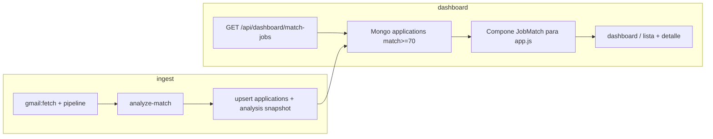
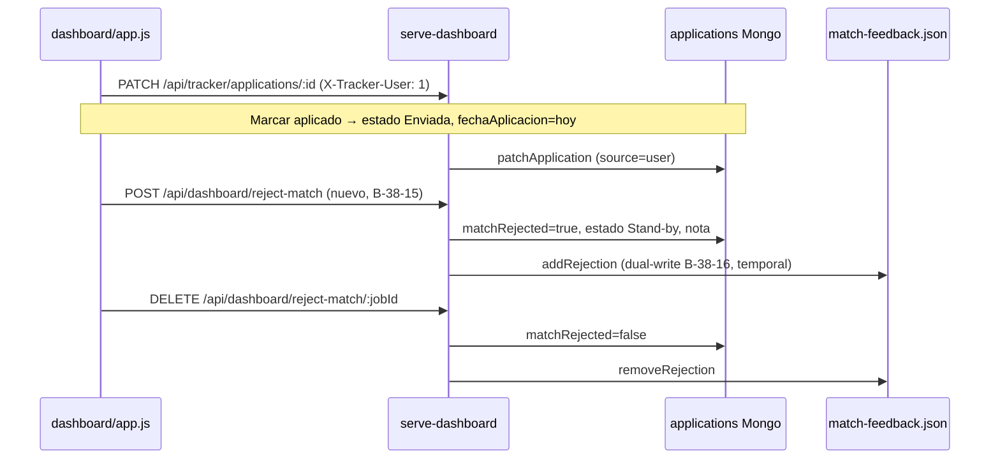

# Spike B-38-11 — Dashboard «Empleos con match» retroalimentado por tracker

**Story:** [US-JH-B38-11-0 #305](https://github.com/gabrielagarayzavalia/GGZenLab-Portfolio/issues/305)  
**Rama:** `chore/spike-b38-11-dashboard-tracker`  
**Fecha:** 2026-07-25  
**Estado:** spike cerrado — **GO** opción A (híbrido)  
**Bloquea:** [#300 B-38-8](https://github.com/gabrielagarayzavalia/GGZenLab-Portfolio/issues/300) deprecar `/api/results`  
**Relacionado:** [#294 B-38-1](https://github.com/gabrielagarayzavalia/GGZenLab-Portfolio/issues/294) tracker MVP · [#297](https://github.com/gabrielagarayzavalia/GGZenLab-Portfolio/issues/297) / [#298](https://github.com/gabrielagarayzavalia/GGZenLab-Portfolio/issues/298) dual-write

## TL;DR

| | |
|---|---|
| **Veredicto** | **GO** — reemplazar `/api/results` en dashboard es viable con arquitectura **híbrida (opción A)** |
| **Lista dashboard** | `applications` Mongo (canónico estado/postulación) filtrada `matchPercent >= 70` |
| **Detalle análisis** | Join lazy con snapshot embebido `analysis` en application **o** colección `jobs` por `jobId`/`url` |
| **Filtros UX** | Mapeo `TrackerEstado` + flag `matchRejected` (no es un estado Excel) |
| **Feedback LLM** | Mantener `match-feedback.json` para aprendizaje hasta B-38-16; sincronizar con tracker |
| **Orden implementación** | #297+#298 (dual-write) → B-38-12…15 → **#300** |

**No implementado en este spike:** cambios en `dashboard/app.js`, deprecación legacy, dual-write.

---

## B38-11-01 (#306) — Inventario gaps campo a campo

### Fuentes actuales

| Store | Path / API | Rol |
|-------|------------|-----|
| Análisis última corrida | `output/jobs-result.json` → `GET /api/results` | `JobMatch[]` + metadata `scrapedAt`, `totalAnalyzed` |
| Estado postulación dashboard | `output/application-status.json` → `GET/POST /api/application-status` | `applied` \| `not_applied` \| `not_selected` por `jobId` |
| Match incorrecto | `output/match-feedback.json` → `GET/POST/DELETE /api/feedback/*` | Rechazos para filtro UI + bloque LLM (`buildFeedbackLearningBlock`) |
| Tracker canónico | Mongo `applications` → `GET/PATCH /api/tracker/applications` | `TrackerApplication` — Excel-like + MVP `/tracker` |
| Jobs discovery (legacy) | Mongo `jobs` → `GET /api/jobs` | Scrape/search; **no** usado hoy por dashboard `/` |

### Tabla campo a campo

| Campo / feature | `JobMatch` | `TrackerApplication` | Usado en `app.js` | Clasificación | Mapeo / propuesta |
|-----------------|------------|----------------------|-------------------|---------------|-------------------|
| ID fila | `id` (jobId LinkedIn) | `id` (ObjectId) + `jobId?` | `job.id` en toda la UI | **overlap** | Lista expone `id=jobId`; internamente `trackerId` para PATCH |
| Título | `title` | `puesto` | lista + detalle | **overlap** | `title` ← `puesto` |
| Empresa | `company` | `empresa` | lista + detalle | **overlap** | directo |
| URL | `url` | `linkedinUrl` | link detalle | **overlap** | directo |
| Match % | `matchPercent` | `matchPercent` | lista, sort, badges | **overlap** | directo; filtro lista `>= 70` |
| Ubicación | `location` | — | detalle meta | **solo dashboard** | `analysis.location` en join/snapshot |
| Modalidad | `modality` | — | lista + detalle | **solo dashboard** | `analysis.modality` |
| Fecha publicación | `datePosted` | — | lista + detalle | **solo dashboard** | `analysis.datePosted` |
| Descripción JD | `description` | — | panel detalle (bullets) | **solo dashboard** | `analysis.description` |
| Término búsqueda | `searchTerm` | — | detalle; feedback reject | **solo dashboard** | `analysis.searchTerm`; necesario para LLM feedback |
| Origen | `source`, `externalId` | — | no renderizado hoy | **solo dashboard** | `analysis.source` en snapshot |
| Skills match | `matchedSkills[]` | — | detalle | **solo dashboard** | `analysis.matchedSkills` |
| Gaps | `gaps[]` | — | detalle | **solo dashboard** | `analysis.gaps` |
| Sugerencias CV | `cvSuggestions[]` | — | detalle | **solo dashboard** | `analysis.cvSuggestions` |
| Resumen LLM | `summary` | — | detalle | **solo dashboard** | `analysis.summary` |
| Estado postulación | vía `application-status` (3 valores) | `estado` (9 valores Excel) | filtros + badges | **overlap conceptual** | ver § B38-11-02 |
| Canal apply | — | `canal` | no en dashboard | **solo tracker** | visible opcional en detalle futuro |
| Fecha aplicación | — | `fechaAplicacion` | no en dashboard | **solo tracker** | set al marcar Aplicado |
| Portal externo | — | `portalExterno` | no | **solo tracker** | — |
| Próximo paso | — | `proximoPaso` | no | **solo tracker** | set en acciones dashboard |
| Notas (bot) | — | `notas` | no | **solo tracker** | append en reject / stand-by |
| Mis comentarios | — | `misComentarios` | no | **solo tracker** | solo usuaria (`X-Tracker-User: 1`) |
| cvType / applyType | — | `cvType`, `applyType` | no | **solo tracker** | pipeline / EA |
| gmailId | — | `gmailId` | no | **solo tracker** | reconcile |
| Match incorrecto | `match-feedback.json` | — (hoy) | filtro + detalle reject | **solo dashboard** | propuesta: `matchRejected` en application (§308) |
| Metadata corrida | `scrapedAt`, `totalAnalyzed` | — | header stats | **solo dashboard** | `GET /api/dashboard/match-jobs` devuelve metadata de último `analysis_runs` |
| Auditoría | — | `updatedBy`, `createdAt`, `updatedAt` | no | **solo tracker** | — |

### `mergeJobsWithStoredState` (comportamiento legacy a preservar)

En `dashboard/app.js` (L384–403): la lista **no** es solo el último `matchedJobs`. Se fusionan:

1. **Último análisis** (`result.matchedJobs`)
2. **Rechazos** en `match-feedback.json` → stub `JobMatch` si el job ya no está en última corrida
3. **Application-status** entries → stub si faltan en análisis

**Implicación tracker:** la lista canónica debe incluir applications con `matchRejected=true` o estados terminales (`Enviada`, `Cerrado`, etc.) aunque no estén en la última corrida de análisis. Campo propuesto: `inLatestAnalysis: boolean` + `lastAnalysisRunId`.

### Stores legacy — resumen

| Store | Writes desde | Deprecación |
|-------|--------------|-------------|
| `jobs-result.json` | `3-analyze-match.ts` | #300 — reemplazar lectura por API híbrida |
| `application-status.json` | dashboard UI, `easy-apply.ts` | B-38-15 — writes van a tracker `estado` |
| `match-feedback.json` | dashboard UI; leído por analyze | B-38-16 — sync a `matchRejected`; mantener export LLM hasta migrar analyze |

---

## B38-11-02 (#307) — Mapeo filtros dashboard ↔ TrackerEstado

### Filtros UI actuales (`app.js` L47–54, L542–556)

| Checkbox UI | Variable | Fuente datos hoy |
|-------------|----------|-------------------|
| Sin clasificar | `showUnmarked` | sin entrada en `application-status` y no rejected |
| Aplicados | `showApplied` | `status === "applied"` |
| No aplicados | `showNotApplied` | `status === "not_applied"` |
| No seleccionada/o | `showNotSelected` | `status === "not_selected"` |
| Match incorrecto | `showRejected` | `jobId` en `match-feedback.json` |

Los filtros son **mutuamente excluyentes** salvo que solo uno esté activo a la vez (al marcar uno se desmarca «Sin clasificar»).

### Tabla mapeo definitiva dashboard → tracker

| Filtro dashboard | `TrackerEstado` incluidos | Excluir siempre | Notas |
|------------------|---------------------------|----------------|-------|
| **Sin clasificar** | `Pendiente` | `matchRejected`, `Duplicado`, `Descartado` | Fila existe en applications con match≥70; usuario aún no clasificó |
| **Aplicados** | `Enviada`, `Borrador abierto`, `A-pendiente`, `A-realizado` | `matchRejected` | Alineado con EA: submit → `Enviada` (`easy-apply.ts` hoy setea `applied`) |
| **No aplicados** | `Stand-by` con `proximoPaso` o `notas` que indiquen decisión manual «no aplicar» | `matchRejected` | **No** usar `Pendiente` (es sin clasificar). Write: `Stand-by` + nota «No aplicado (dashboard)» |
| **No seleccionada/o** | `Cerrado` | `matchRejected` | Write: `Cerrado` + `notas`/`proximoPaso` «No seleccionada/o (dashboard)». **Bot** puede setear `Cerrado` si aviso LinkedIn cerrado (flujo EA existente en Excel) |
| **Match incorrecto** | *(no es estado)* | — | `matchRejected === true` en application; ver § feedback |

### Edge cases por `TrackerEstado`

| Estado | ¿Visible en lista match? | Filtro por defecto | Notas |
|--------|--------------------------|--------------------|-------|
| `Pendiente` | Sí (si match≥70) | Sin clasificar | Creado por pipeline dual-write o seed |
| `Stand-by` | Sí | No aplicados **si** nota manual; sino Sin clasificar ambiguo → preferir tag `dashboardTag: not_applied` en snapshot o convención en `notas` | Bot usa Stand-by con nota; no confundir con «no aplicado» usuario |
| `Enviada` | Sí | Aplicados | `fechaAplicacion` al marcar aplicado |
| `Borrador abierto` | Sí | Aplicados | EA dejó borrador |
| `A-pendiente` | Sí | Aplicados | Assessment pendiente |
| `A-realizado` | Sí | Aplicados | Assessment hecho |
| `Cerrado` | Sí | No seleccionada/o (si manual) o histórico | Oferta cerrada / decisión usuario |
| `Duplicado` | **No** (oculto por defecto) | — | Dedupe pipeline; no en lista match salvo vista tracker |
| `Descartado` | **No** (oculto) | — | **Solo usuaria** en tracker/Excel; nunca bot |
| `matchRejected` | Sí | Match incorrecto | Flag booleano, no `TrackerEstado` |

### Modelo feedback «match incorrecto»

**Problema:** `match-feedback.json` guarda `searchTerm`, `matchPercent`, `reason` para `buildFeedbackLearningBlock()` — el analyze **necesita** ese store hoy.

**Propuesta (recomendada):**

| Capa | Responsabilidad |
|------|-----------------|
| **Tracker** (`applications`) | `matchRejected: true`, `matchRejectedReason?`, `matchRejectedAt?`, `estado` → `Stand-by` (bot **nunca** `Descartado`) + nota «Match incorrecto (dashboard)» |
| **match-feedback.json** | Dual-write temporal (B-38-16) para LLM hasta que analyze lea rejections desde Mongo |
| **Filtro UI** | Lee `matchRejected` del tracker (fuente display); durante transición OR con feedback legacy |

**Undo reject:** `matchRejected=false`, quitar nota de reject, DELETE en feedback legacy.

**Política bot:** `coerceAutomationEstado` — reject es acción **usuaria** (`X-Tracker-User: 1`); el bot no setea `matchRejected`.

### Derivación filtro → query (implementación futura)

```typescript
// Pseudocódigo servidor — GET /api/dashboard/match-jobs?filter=unmarked|applied|...
function estadosForFilter(filter: DashboardFilter): TrackerEstado[] | null { ... }
function mongoFilter(filter: DashboardFilter) {
  if (filter === "rejected") return { matchRejected: true };
  if (filter === "unmarked") return { estado: "Pendiente", matchRejected: { $ne: true } };
  // ...
}
```

---

## B38-11-03 (#308) — Diseño retroalimentación read/write

### Comparativa opciones

| Criterio | **A Híbrido** | B Todo-en-uno | C Legacy detalle |
|----------|---------------|---------------|------------------|
| Un store canónico lista+estado | ✅ applications | ✅ | ❌ split |
| Tamaño documento Mongo | Medio (snapshot opcional) | Grande | Medio |
| Paridad detalle JD/análisis | ✅ join/snapshot | ✅ | ✅ parcial |
| Cumple #300 (sin jobs-result) | ✅ | ✅ | ❌ |
| Esfuerzo migración | Medio | Alto (schema + pipeline) | Bajo pero deuda |
| Alineado dual-write #297 | ✅ | ✅ | ⚠️ |

### Recomendación: **Opción A — Híbrido**

- **Canónico operativo:** `applications` (estado, notas, postulación, match%).
- **Análisis LLM:** subdocumento `analysis?: AnalysisSnapshot` en application, poblado por dual-write (#297) al upsert post-analyze; fallback join `jobs` por `jobId`/`linkedinUrlNorm` si falta snapshot.
- **Detalle dashboard:** API compone `JobMatch` para el cliente sin cambiar shape del front (minimiza diff `app.js` en B-38-14).

```typescript
// Propuesta — src/types/dashboard-match.ts
interface AnalysisSnapshot {
  location: string;
  modality: string;
  datePosted: string;
  description: string;
  searchTerm: string;
  source?: string;
  matchedSkills: string[];
  gaps: string[];
  cvSuggestions: string[];
  summary: string;
  analyzedAt: string;
  runId?: string;
}

// Extensión TrackerApplication (B-38-13)
interface TrackerApplication {
  // ...existente...
  analysis?: AnalysisSnapshot;
  matchRejected?: boolean;
  matchRejectedReason?: string;
  matchRejectedAt?: string;
  inLatestAnalysis?: boolean;
}
```

### Flujo read (post dual-write)



### Flujo write (acciones UI → tracker)



### Contrato API propuesto

| Método | Ruta | Descripción |
|--------|------|-------------|
| `GET` | `/api/dashboard/match-jobs` | Reemplazo de `/api/results` para lista+detalle. Query: `filter`, `sort`, `order`. Devuelve `{ scrapedAt, totalAnalyzed, jobs: JobMatch[], meta }` |
| `GET` | `/api/dashboard/match-jobs/:jobId` | Detalle uno (opcional; puede bastar lista completa) |
| `PATCH` | `/api/tracker/applications/:id` | Ya existe — acciones estado (header user) |
| `POST` | `/api/dashboard/reject-match` | Body: `{ jobId, title, company, searchTerm, matchPercent, reason? }` → tracker + feedback |
| `DELETE` | `/api/dashboard/reject-match/:jobId` | Undo reject |
| `GET` | `/api/results` | **Deprecated** (#300) — shim que delega a match-jobs durante transición |

**Compatibilidad `app.js`:** B-38-14 cambia L567 `fetch("/api/results")` → `fetch("/api/dashboard/match-jobs")` manteniendo mismo shape de `jobs` + metadata. Elimina `mergeJobsWithStoredState` cuando el servidor incluya históricos.

### Tabla acciones UI → writes tracker

| Acción UI (`app.js`) | Write hoy | Write propuesto (source=`user`) | Política |
|----------------------|-----------|----------------------------------|----------|
| Marcar **Aplicado** (L303) | `POST /api/application-status` `applied` | `PATCH` tracker: `estado=Enviada`, `fechaAplicacion=ISO date` | — |
| **No aplicado** (L304) | `not_applied` | `estado=Stand-by`, `notas+=` «No aplicado (dashboard)» | Bot no pisa si ya `Enviada`/`Cerrado` |
| **No seleccionada/o** (L305) | `not_selected` | `estado=Cerrado`, `proximoPaso` o `notas` | Bot puede `Cerrado` por aviso cerrado (automation) — distinto motivo |
| Desmarcar checkbox (L305) | `status=null` | `estado=Pendiente` (si no `Enviada`/protegido) | Respetar estados protegidos Excel |
| **Match incorrecto** (L472) | `POST /api/feedback/reject` | `matchRejected=true`, `estado=Stand-by`, nota + dual-write feedback | **Nunca** `Descartado` |
| **Deshacer reject** (L495) | `DELETE /api/feedback/reject/:id` | `matchRejected=false` + remove feedback | — |

**Easy Apply** (#298): reemplazar `setApplicationStatus(..., "applied")` por `patchApplication` automation → `estado=Enviada` (ya alineado Excel).

### Dependencia dual-write (#297 / #298)

Sin dual-write, `applications` solo tiene seed Excel (148 filas) y **no** los `JobMatch` del último analyze. Orden:

1. **#297** — post-pipeline/analyze: upsert `applications` con `analysis` snapshot + `matchPercent` + `estado=Pendiente` si nuevo.
2. **#298** — EA actualiza `estado`/`notas` en tracker (no `application-status.json`).
3. **B-38-12…15** — API + wire dashboard.
4. **#300** — deprecar `/api/results` y stores JSON.

---

## B38-11-04 (#309) — Go/no-go + breakdown implementación

### Go / No-go

| Pregunta | Respuesta |
|----------|-----------|
| ¿Lista dashboard puede leer solo tracker? | **Sí**, con filtro match≥70 + campos derivados |
| ¿Detalle JD/análisis sin jobs-result? | **Sí**, vía `analysis` snapshot en application (opción A) |
| ¿Filtros actuales mapeables a TrackerEstado? | **Sí**, con flag `matchRejected` aparte |
| ¿Política Descartado respetada? | **Sí** — reject → Stand-by + flag, nunca Descartado por bot |
| ¿Bloqueadores? | Dual-write #297 debe existir antes de cutover; sin eso dashboard quedaría vacío post-analyze |

**Veredicto: GO** para opción A. **#300 puede arrancar después de B-38-12 + B-38-14** (con shim temporal opcional).

### Stories implementación propuestas (B-38-12+)

| ID | Título | Prioridad | Depende de | Entregable |
|----|--------|-----------|------------|------------|
| **B-38-12** | API `GET /api/dashboard/match-jobs` (join tracker + analysis) | High | #297 (datos) | `src/dashboard/match-jobs.ts`, tests |
| **B-38-13** | Extender schema `applications`: `analysis`, `matchRejected`, flags | High | — | `tracker-application.ts`, migración índices |
| **B-38-14** | Wire `dashboard/app.js` → nueva API (lista + detalle) | High | B-38-12 | Cambio fetch L567; remover `mergeJobsWithStoredState` |
| **B-38-15** | Writes dashboard → tracker (reemplazar application-status) | High | B-38-13 | PATCH + `POST/DELETE reject-match` |
| **B-38-16** | Sync `match-feedback` ↔ `matchRejected` + analyze lee Mongo | Medium | B-38-15 | `feedback.ts` + `3-analyze-match.ts` |
| **B-38-17** | Shim deprecación `/api/results` → match-jobs | Low | B-38-14 | #300 |

**Ya en backlog (orden relativo):**

| Issue | Rol |
|-------|-----|
| [#297](https://github.com/gabrielagarayzavalia/GGZenLab-Portfolio/issues/297) | Dual-write pipeline — **prerrequisito datos** |
| [#298](https://github.com/gabrielagarayzavalia/GGZenLab-Portfolio/issues/298) | Dual-write EA — alinea `Enviada` |
| [#300](https://github.com/gabrielagarayzavalia/GGZenLab-Portfolio/issues/300) | Deprecar legacy — **después** B-38-12…15 |
| [#295](https://github.com/gabrielagarayzavalia/GGZenLab-Portfolio/issues/295) | Mobile lite — misma API match-jobs post B-38-12 |

### Orden sugerido actualizado

```
#297 dual-write pipeline
    ↓
#298 dual-write EA
    ↓
B-38-13 schema → B-38-12 API match-jobs → B-38-14 wire dashboard → B-38-15 writes
    ↓
B-38-16 feedback sync (puede solapar con B-38-15)
    ↓
#300 deprecar /api/results (+ B-38-17 shim)
    ↓
#295 mobile lite (misma API)
```

### Criterios de aceptación #305 — checklist

- [x] Inventario campo a campo completo (#306)
- [x] Tabla mapeo filtros ↔ TrackerEstado + edge cases (#307)
- [x] Diseño read/write + diagramas + contrato API (#308)
- [x] Go/no-go + breakdown B-38-12…17 (#309)
- [x] Spike only — sin cambios productivos en `app.js`

---

## Referencias código

| Archivo | Relevancia |
|---------|------------|
| `dashboard/app.js` L567 | `fetch("/api/results")` — punto de corte B-38-14 |
| `dashboard/app.js` L384–403 | `mergeJobsWithStoredState` — comportamiento a replicar en servidor |
| `dashboard/app.js` L311–336 | `saveApplicationStatus` → migrar a PATCH tracker |
| `src/serve-dashboard.ts` L187–208 | `/api/results` ensambla jobs-result + feedback + application-status |
| `src/tracker/estado-policy.ts` | Política Descartado / automation |
| `src/feedback.ts` L84–107 | Bloque aprendizaje LLM — mantener hasta B-38-16 |
| `src/types.ts` | `JobMatch`, `AnalysisResult` |
| `src/types/tracker-application.ts` | Schema canónico tracker |

---

## Cómo validar (post-implementación, no spike)

```bash
cd projects/qa-job-hunter
docker compose up -d
# Tras #297: run pipeline + analyze
npm run dashboard
# / — lista debe coincidir con tracker para jobs match>=70
# Marcar aplicado → ver Enviada en /tracker
# Match incorrecto → matchRejected + feedback para próximo analyze
```
