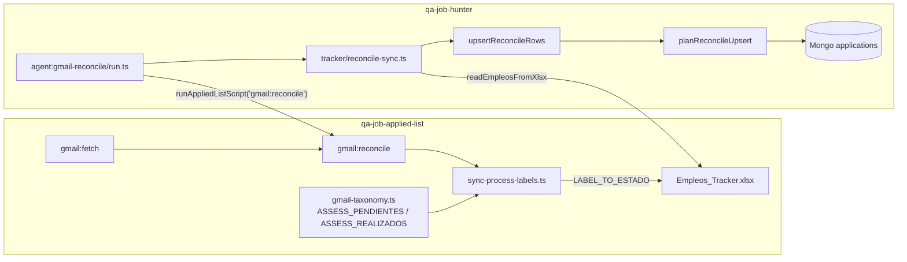

# Spike #414 — Gmail Entrevistas-Assessments → A-pendiente / A-realizado en Mongo

**Issue:** [#414](https://github.com/gabrielagarayzavalia/GGZenLab-Portfolio/issues/414)  
**Relacionado:** [#410](https://github.com/gabrielagarayzavalia/GGZenLab-Portfolio/issues/410) QA dashboard A-pendiente · [#361](https://github.com/gabrielagarayzavalia/GGZenLab-Portfolio/issues/361) reconcile Mongo · B-23-02  
**Estado:** cerrado (spike + fix acotado)  
**Rama:** `spike/414-gmail-assessments-mongo`

---

## 1. Flujo actual (Gmail label → Excel → Mongo)



**Orden campaña:** fetch → pipeline → Excel (revisión) → apply → `gmail:reconcile` → `syncReconcileToTracker()` (si `TRACKER_DUAL_WRITE=1`).

**Mapeo Gmail → Excel (applied-list):**

| Label Gmail | Constante taxonomy | Estado Excel |
|-------------|-------------------|--------------|
| `Entrevistas-Assessments/Pendientes` | `ASSESS_PENDIENTES` | `A-pendiente` |
| `Entrevistas-Assessments/Realizados` | `ASSESS_REALIZADOS` | `A-realizado` |

`gmail:reconcile` ya escribe esos estados en Excel vía `sync-process-labels.ts` + `LABEL_TO_ESTADO`. El gap estaba **solo en hunter → Mongo**.

---

## 2. Root cause confirmado

### Gap A — `planReconcileUpsert` skip sin documento Mongo

```typescript
if (!existing) return { action: "skip" };
```

Reconcile Mongo **solo actualizaba** filas existentes. Jobs con assessment en Excel pero sin pasar por pipeline/Easy Apply dual-write **nunca** llegaban a Mongo.

**Síntoma:** Excel `A-pendiente`, dashboard sin fila o con `Pendiente`/`Enviada` desactualizado.

### Gap B — `isProtectedEstado` bloqueaba promoción Enviada → assessment

`Enviada` está en `PROTECTED` (correcto para pipeline sync, incorrecto para reconcile Gmail).

Flujo típico post-apply:

1. Easy Apply → Mongo `Enviada`
2. Mail assessment → label Gmail → Excel `A-pendiente`
3. `planReconcileUpsert({ estado: "Enviada" }, { estado: "A-pendiente" })` → **skip** (protegido)

**Root cause de #410:** dashboard lee Mongo; reconcile no promovía `Enviada` → `A-pendiente` / `A-realizado`.

### No es gap (validado)

| Tema | Estado |
|------|--------|
| Excel match jobId/URL | `isReconcileSyncableRow` + `excelRowToReconcileFields` OK |
| `TRACKER_DUAL_WRITE=0` | Omite sync por diseño; doc en `campaign-flow.md` |
| Classify vs process labels | Assessments usan **process** labels (`sync-process-labels`), no classify |
| Pipeline pisa A-pendiente | Pipeline usa `planAutomationUpsert` + protegidos — no pisa assessment en Mongo |

---

## 3. Inventario gaps (resumen)

| # | Gap | Severidad | Fix spike |
|---|-----|-----------|-----------|
| A | Sin insert reconcile para assessment | Alta | Insert si `A-pendiente`/`A-realizado` + jobId/URL |
| B | Enviada bloqueada al promover a assessment | **Crítica (#410)** | `canReconcilePromoteEstado` en lugar de skip blanket |
| C | Terminal (Cerrado/Descartado/Duplicado) | — | Sigue skip (correcto) |
| D | Downgrade A-realizado → A-pendiente | — | Bloqueado explícitamente |
| E | Sin Gmail API en CI | — | Unit tests `reconcile-sync.test.ts` |

---

## 4. Decisión: GO con fix acotado (mismo PR spike)

**Implementado en hunter** (sin tocar applied-list ni Gmail API):

1. **`canReconcilePromoteEstado`** — promociones permitidas:
   - `Pendiente` / `Enviada` / `Stand-by` / `Borrador abierto` → `A-pendiente` / `A-realizado`
   - `A-pendiente` → `A-realizado`
   - `Pendiente` → `Enviada` / `Stand-by` (comportamiento previo)
   - Terminal y downgrades → skip

2. **`planReconcileUpsert`** — insert cuando Excel trae assessment y hay `jobId` o `linkedinUrlNorm`.

3. **`upsertReconcileRows`** — maneja `action: "insert"`; `ReconcileUpsertResult.inserted`.

4. **Tests** — casos Enviada→A-pendiente, insert sin existing, A-pendiente→A-realizado, terminales.

5. **Script QA opcional** — `npm run qa:seed-assessment-estados` (2 docs fixture para #410).

### Story hija — no requerida

El fix cabe en el spike; no se abre story separada salvo regresión en campaña real.

---

## 5. Verificación

```bash
cd projects/qa-job-hunter
docker compose up -d
npm run test:tracker

# QA manual dashboard #410 (Mongo local)
npm run qa:seed-assessment-estados
npm run dashboard
# → filtro assessment / badge A-pendiente y A-realizado
```

**Campaña real (manual, fuera CI):**

```bash
npm run agent:gmail-reconcile   # gmail:reconcile + syncReconcileToTracker
```

---

## 6. Archivos tocados

| Archivo | Cambio |
|---------|--------|
| `src/tracker/automation-merge.ts` | `canReconcilePromoteEstado`, insert assessment, promoción reconcile |
| `src/db/applications.ts` | `upsertReconcileRows` insert + `inserted` en result |
| `src/tracker/reconcile-sync.ts` | Log con insertadas |
| `tests/tracker/reconcile-sync.test.ts` | Casos #414 |
| `scripts/seed-assessment-estados.ts` | Seed QA #410 |
| `package.json` | script `qa:seed-assessment-estados` |
